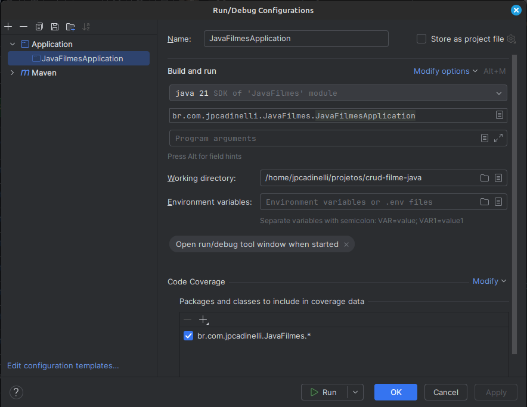

# 🎬 API CRUD de Filmes (Spring Boot)

Este projeto é um **CRUD simples de filmes** em **Java com Spring Boot**, utilizando:

- ✅ Inversão de Controle (IoC) e Injeção de Dependência (DI)
- ✅ Repository em memória (sem banco de dados)
- ✅ DTOs para entrada e saída de dados
- ✅ Validação de dados com `jakarta.validation`

---

## ⚙️ Tecnologias

- Java 17+
- Spring Boot 3
- Maven
- Jakarta Validation

---

## 🚀 Como rodar o projeto

### 1. Clonar o repositório
```bash
git clone https://github.com/jpcadinelli/crud-filme-java
cd crud-filme-java

### 2. Rodar a aplicação
```bash
mvn spring-boot:run
```

ou, utilize esta configuração no intelliJ


A aplicação subirá em:  
👉 `http://localhost:8080/filmes`

---

## 🔄 Atualizando dependências com Maven

Sempre que você adicionar novas dependências no `pom.xml`, rode:

```bash
mvn clean install
```

ou, utilize a configuração do intelliJ


ou, se quiser apenas compilar e atualizar o cache de libs:

```bash
mvn clean package
```

Isso garante que o Maven baixe todas as dependências necessárias.

---

## 📌 Endpoints disponíveis

### 1️⃣ Criar um filme
```bash
curl -X POST http://localhost:8080/filmes \
  -H "Content-Type: application/json" \
  -d '{
    "titulo": "O Senhor dos Anéis",
    "diretor": "Peter Jackson",
    "anoLancamento": 2001
  }'
```

---

### 2️⃣ Listar todos os filmes
```bash
curl -X GET http://localhost:8080/filmes
```

---

### 3️⃣ Buscar filme por ID
```bash
curl -X GET http://localhost:8080/filmes/1
```

---

### 4️⃣ Atualizar um filme
```bash
curl -X PUT http://localhost:8080/filmes/1 \
  -H "Content-Type: application/json" \
  -d '{
    "titulo": "O Senhor dos Anéis: A Sociedade do Anel",
    "diretor": "Peter Jackson",
    "anoLancamento": 2001
  }'
```

---

### 5️⃣ Deletar um filme
```bash
curl -X DELETE http://localhost:8080/filmes/1
```

---

## ✅ Exemplos de respostas

### Criar ou atualizar (POST/PUT)
```json
{
  "id": 1,
  "titulo": "O Senhor dos Anéis",
  "diretor": "Peter Jackson",
  "anoLancamento": 2001
}
```

### Listar todos (GET)
```json
[
  {
    "id": 1,
    "titulo": "O Senhor dos Anéis",
    "diretor": "Peter Jackson",
    "anoLancamento": 2001
  }
]
```

### Erro de validação (exemplo POST sem título)
```json
{
  "titulo": "O título é obrigatório"
}
```
